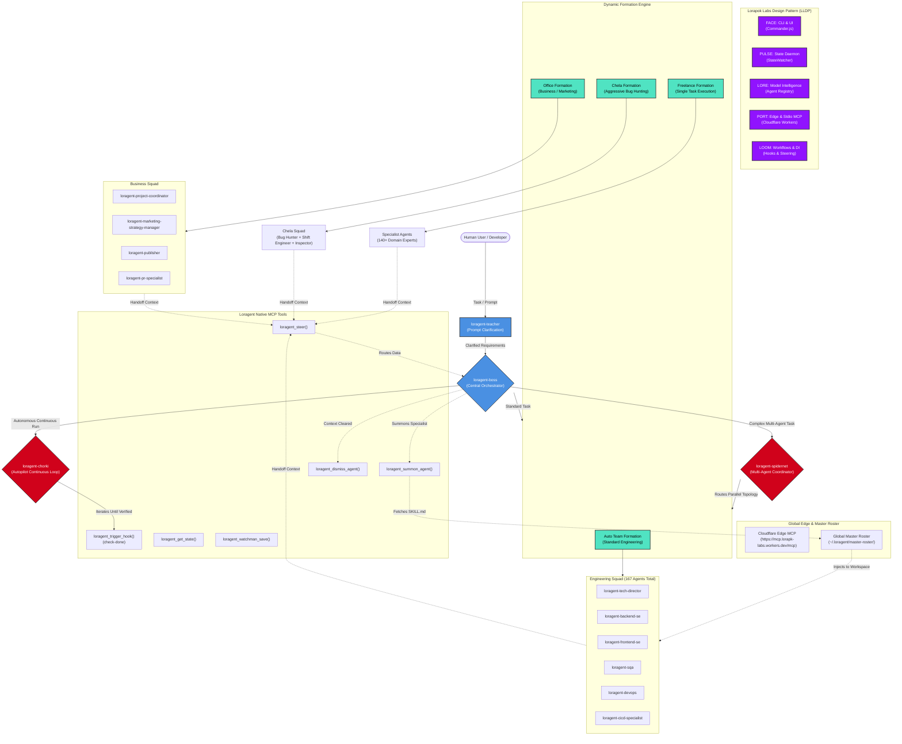

# 🏗️ Loragent Ecosystem Architecture

The following diagram illustrates the flow and hierarchy of the Loragent Ecosystem, featuring Boss Mode orchestration, Spidernet Multi-Agent Routing, the 4 Formation Modes, Chorki Autopilot Verification Loop, Cloudflare Edge MCP, and the LLDP 5-Layer Framework.

