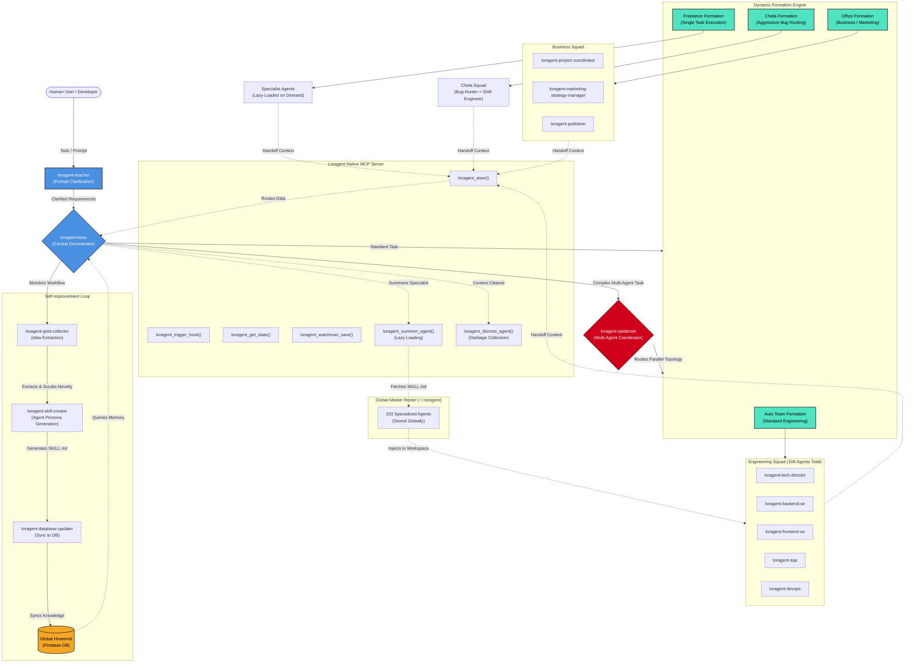

# Loragent Architecture

The following diagram illustrates the flow and hierarchy of the Loragent Ecosystem, featuring Boss Mode orchestration, Spidernet Multi-Agent Routing, the 4 Formation Modes, and the Firebase Self-Improvement Loop.

