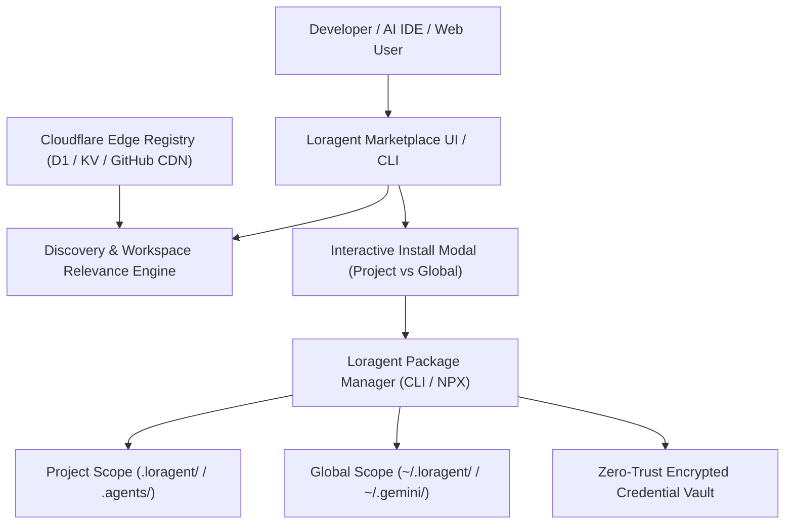
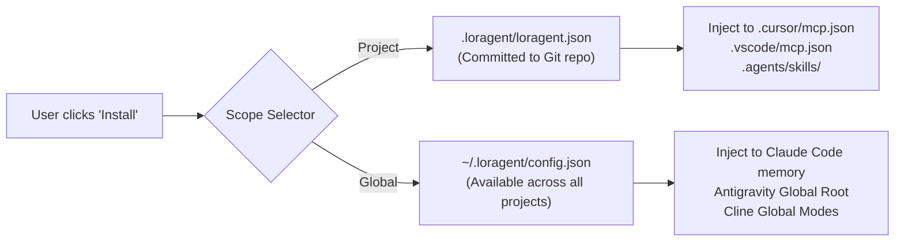

# 🌐 Loragent Marketplace — Architectural Specification & Future Roadmap

> **Inspired by [Kilo Marketplace](https://github.com/Kilo-Org/kilo-marketplace) & Blackbox AI Ecosystem**  
> **Standard:** LLDP (Lorapok Labs Design Pattern) | **Version:** 2.0.0-PROPOSAL | **Target:** Multi-IDE & Web

---

## 📑 Table of Contents

1. [Executive Vision & Philosophy](#1-executive-vision--philosophy)
2. [Comparative Architecture: Kilo vs Loragent](#2-comparative-architecture-kilo-vs-loragent)
3. [Resource Taxonomy & Directory Standard](#3-resource-taxonomy--directory-standard)
4. [Registry Schema Specification (`marketplace.json`)](#4-registry-schema-specification-marketplacejson)
5. [Client-Side Installation & Scope Resolver](#5-client-side-installation--scope-resolver)
6. [Interactive UI/UX Experience & Modal System](#6-interactive-uiux-experience--modal-system)
7. [Workspace Relevance & Auto-Detection Engine](#7-workspace-relevance--auto-detection-engine)
8. [Zero-Trust Security & Permission Sandbox](#8-zero-trust-security--permission-sandbox)
9. [Publishing Pipeline & CI/CD Verification Gate](#9-publishing-pipeline--cicd-verification-gate)
10. [Phased Implementation Roadmap & Milestones](#10-phased-implementation-roadmap--milestones)

---

## 1. Executive Vision & Philosophy

The **Loragent Marketplace** is a universal, open-standard registry and distribution network for **AI Agents**, **Agent Skills**, **Model Context Protocol (MCP) Servers**, and **Orchestration Formations**. 

While traditional marketplaces treat AI tools as static extensions, Loragent Marketplace treats them as dynamic, composable intelligence modules that can be installed either **per-project** or **globally**, interoperating seamlessly across:
- **VS Code & Cursor**
- **Claude Code & Anthropic Workflows**
- **Windsurf, Roo Code & Cline**
- **Google Antigravity & Zed**
- **Web Dashboards & Terminal CLIs**



---

## 2. Comparative Architecture: Kilo vs Loragent

| Feature | Kilo Marketplace | Loragent Marketplace (Target Plan) |
|---|---|---|
| **Primary Artifacts** | Skills (`SKILL.md`), MCP Servers, Modes | Skills (`SKILL.md`), MCP Servers, Agents (`224+`), Formations (`6`) |
| **Specification Format** | Open Agent Skills (`SKILL.md` frontmatter) | Extended LLDP + Open Agent Skills + MCP JSON-RPC 2.0 |
| **Installation Scopes** | Project (`.kilo/kilo.json`) vs Global | Project (`.loragent/loragent.json`, `.agents/`) vs Global (`~/.loragent/`) |
| **Credential Management** | Plaintext config / manual env vars | Machine AES-256 Encrypted Vault (`secure-cred-vault` + PIN manager) |
| **Workspace Intelligence** | Checkbox filter for project context | AST dependency scanner (`package.json`, `Cargo.toml`, `requirements.txt`) |
| **IDE Compatibility** | Kilo Code (VS Code fork), CLI | Multi-IDE (Cursor, Claude Code, Windsurf, Antigravity, VS Code, Roo, Zed) |
| **Distribution Methods** | NPX, Git repo clone, Direct JSON inject | NPX, `loragent install`, GitHub CDN, Edge Worker API, Stdio/SSE |

---

## 3. Resource Taxonomy & Directory Standard

The marketplace repository (`loragent-marketplace` or `Maijied/loragent-marketplace`) adopts a modular, self-documenting directory structure:

```text
loragent-marketplace/
├── .github/
│   └── workflows/
│       ├── validate-registry.yml     # Automated schema & AST linter
│       ├── security-scan.yml         # Secret detection & safe tool verification
│       └── deploy-registry.yml       # Builds CDN manifest & syncs to Edge D1
├── agents/                           # Full Agent specifications (Role + Persona + Tools)
│   ├── loragent-boss/
│   │   ├── agent.json
│   │   └── README.md
│   ├── loragent-sqa/
│   └── ...
├── skills/                           # Modular workflows (Agent Skills spec)
│   ├── youtube-downloader/
│   │   ├── SKILL.md
│   │   └── scripts/
│   ├── react-perf-audit/
│   └── ...
├── mcp-servers/                      # Model Context Protocol servers
│   ├── cloudflare-edge-mcp/
│   │   ├── mcp.json
│   │   └── server.js
│   ├── firebase-admin-mcp/
│   └── ...
├── formations/                       # Multi-agent squad presets
│   ├── auto-team.json
│   ├── chela-debugger.json
│   └── office-suite.json
├── schemas/
│   ├── agent.schema.json
│   ├── skill.schema.json
│   └── marketplace.schema.json
├── registry/
│   ├── marketplace.json              # Full compiled catalog
│   ├── categories.json
│   └── badges.json
└── README.md
```

### Resource Types & Badges

1. **`AGENT`**: Autonomous, goal-driven agents with predefined tools, permissions, and behavior rules.
2. **`SKILL`**: Step-by-step instructions and reusable workflows defined via standard `SKILL.md`.
3. **`MCP SERVER`**: Real-time tool providers implementing Model Context Protocol (tools, prompts, resources).
4. **`FORMATION`**: Squad orchestrations linking multiple specialized agents under a designated lead agent.

---

## 4. Registry Schema Specification (`marketplace.json`)

Every item in the marketplace is cataloged with strict metadata:

```json
{
  "$schema": "https://loragent.lorapok.tech/schemas/marketplace.schema.json",
  "version": "2.0.0",
  "generatedAt": "2026-08-29T08:00:00Z",
  "totalItems": 350,
  "items": [
    {
      "id": "firebase-mcp",
      "slug": "firebase",
      "name": "Firebase Admin & Firestore MCP",
      "type": "MCP SERVER",
      "category": "DATA",
      "version": "1.4.0",
      "author": {
        "name": "Lorapok Labs",
        "url": "https://github.com/LorapokLabs",
        "verified": true
      },
      "description": "An MCP server giving AI agents direct capabilities to manage Firestore databases, Auth, Functions, and Cloud Storage.",
      "longDescription": "Connect your AI IDE directly to Firebase projects. Includes live schema query, security rule auditor, and deployment triggers.",
      "iconUrl": "https://loragent.lorapok.tech/icons/firebase.svg",
      "tags": ["firebase", "firestore", "database", "auth", "mcp"],
      "prerequisites": ["Node.js >= 18", "Firebase CLI"],
      "installation": {
        "methods": ["NPX", "BINARY", "GLOBAL_CLI"],
        "defaultMethod": "NPX",
        "npx": {
          "package": "@lorapok/firebase-mcp",
          "args": ["start"]
        },
        "configs": {
          "mcpServer": {
            "command": "npx",
            "args": ["-y", "@lorapok/firebase-mcp@latest", "start"],
            "env": {
              "FIREBASE_TOKEN": "${VAULT:firebase_token}"
            }
          }
        }
      },
      "permissions": {
        "networkAccess": true,
        "filesystemAccess": false,
        "destructiveOperations": false,
        "requiredEnvSecrets": ["FIREBASE_TOKEN"]
      },
      "stats": {
        "downloads": 14250,
        "rating": 4.95,
        "stars": 320
      },
      "detection": {
        "matchFiles": ["firebase.json", ".firebaserc"],
        "matchDependencies": ["firebase", "firebase-admin"]
      }
    }
  ]
}
```

---

## 5. Client-Side Installation & Scope Resolver

The Loragent CLI (`loragent install <id>`) and IDE UI support dual install targets:



### Destination Mapping

- **Project Destination**:
  - Config: `.loragent/loragent.json`
  - Skills: `.agents/skills/<skill-slug>/SKILL.md`
  - MCP: `.mcp.json` / `.cursor/mcp.json`
- **Global Destination**:
  - Config: `~/.loragent/config.json`
  - Global Skills: `~/.gemini/config/skills/<skill-slug>/`
  - Global MCP: `~/.claude/mcp.json` / `~/.cursor/mcp.json`

---

## 6. Interactive UI/UX Experience & Modal System

Based on modern IDE sensory standards, the marketplace modal includes:

```text
┌────────────────────────────────────────────────────────────────────────┐
│  Install Firebase                                                  [✕] │
├────────────────────────────────────────────────────────────────────────┤
│  An MCP server gives AI agents additional tools for working with       │
│  external services or local programs.                                  │
│                                                                        │
│  Learn how Marketplace installs work  •  Learn more about MCP          │
│                                                                        │
│  Where should this be available?                                       │
│  ┌──────────────┐  ┌──────────────┐                                    │
│  │   project    │  │    global    │                                    │
│  └──────────────┘  └──────────────┘                                    │
│  Only this project. The installed files can be committed & shared.     │
│                                                                        │
│  Installation destination                                              │
│  ┌──────────────────────────────────────────────────────────────────┐  │
│  │ .loragent/loragent.json                                          │  │
│  └──────────────────────────────────────────────────────────────────┘  │
│                                                                        │
│  ┌─ ⚠️ Security & Permissions ─────────────────────────────────────┐  │
│  │ MCP servers can run local commands or connect to external        │  │
│  │ services. Loragent Zero-Trust Vault will encrypt any injected   │  │
│  │ credentials. Never store plaintext secrets in committed files.   │  │
│  └──────────────────────────────────────────────────────────────────┘  │
│                                                                        │
│  Installation Method                                                   │
│  ┌───────────────────────────────┐                                     │
│  │ NPX                         ▼ │                                     │
│  └───────────────────────────────┘                                     │
│                                                                        │
│  Prerequisites                                                         │
│  • Node.js >= 18.0.0                                                   │
│                                                                        │
│                                            [ Cancel ]   [ Install 🚀 ] │
└────────────────────────────────────────────────────────────────────────┘
```

### Filter & Category Taxonomy

- **Categories**:
  - `BUSINESS`: Strategy, Legal, Marketing, PR, Project Coordination
  - `CREATIVE MEDIA`: Image Generation, GIF Creation, 3D Design, Copywriting
  - `DATA`: BigQuery, Postgres, Firebase, Redis, Elasticsearch
  - `DEVELOPMENT`: Frontend, Backend, Refactoring, Language Specialists
  - `DEVOPS & CLOUD`: Cloudflare, Docker, Railway, Vercel, Kubernetes
  - `SECURITY & QA`: SQA Testing, Bug Hunter, Zero-Trust Vault, Workspace Guard
- **Search & Workspace Filters**:
  - `[x] Relevant to my workspace`: Auto-scans open project files.
  - `Type Dropdown`: `All Items`, `Agents`, `Skills`, `MCP Servers`, `Formations`.

---

## 7. Workspace Relevance & Auto-Detection Engine

When the user opens the Marketplace, an AST worker inspects the workspace:
1. **File Signatures**:
   - `wrangler.jsonc` / `wrangler.toml` → Recommends `Cloudflare Wrangler Specialist`, `Durable Objects`, `Cloudflare MCP`.
   - `firebase.json` → Recommends `Firebase Admin MCP`, `Firestore Security Auditor`.
   - `Dockerfile` / `docker-compose.yml` → Recommends `Deploy Docker`, `DevOps Specialist`.
   - `next.config.*` / `vite.config.*` → Recommends `Frontend SE`, `Web Perf Audit`, `UI/UX Specialist`.
2. **Dependency Signatures**:
   - Matches packages in `package.json`, `pyproject.toml`, `requirements.txt`, `composer.json`.

---

## 8. Zero-Trust Security & Permission Sandbox

1. **Vault Secret Interpolation**:
   - The marketplace prevents plaintext tokens. Instead of storing tokens in JSON, it uses `${VAULT:<key>}` references resolved at execution time by `pin-manager.js`.
2. **Workspace Guard Integration**:
   - Marketplace assets cannot execute destructive actions (`rm -rf`, database drops) without explicit authorization flag (`allowDestructive: true`).
3. **Verified Publisher Badges**:
   - Official Lorapok Labs assets carry the verified green badge.
   - Community-submitted assets run in read-only sandbox mode until authorized.

---

## 9. Publishing Pipeline & CI/CD Verification Gate

Community creators can publish assets via GitHub PR or CLI:

```bash
# 1. Author and test locally
loragent create-skill my-custom-skill
loragent test-skill my-custom-skill

# 2. Package and validate against schema
loragent marketplace validate ./skills/my-custom-skill

# 3. Publish to Loragent Registry
loragent marketplace publish --tag latest
```

### Automated CI Pipeline (`.github/workflows/marketplace-ci.yml`)
1. **Schema Check**: Validates `SKILL.md` frontmatter and `mcp.json` parameters.
2. **Secret Scan**: Uses `secret-scan.sh` to block embedded API keys or tokens.
3. **Executable Test**: Executes unit tests in an isolated container sandbox.
4. **Registry Compilation**: Appends new entry to `registry/marketplace.json` and purges Cloudflare CDN cache.

---

## 10. Phased Implementation Roadmap & Milestones

### 📍 Phase 1: Core Registry & Standard (Week 1–2)
- [ ] Create `schemas/marketplace.schema.json` and validation script.
- [ ] Index existing 224 agents, skills, and MCP configs into canonical `registry/marketplace.json`.
- [ ] Add `loragent marketplace search`, `list`, `info` commands to Loragent CLI.

### 📍 Phase 2: Web Marketplace Portal (Week 3–4)
- [ ] Build dedicated `/marketplace` route on `loragent-web` (Next.js 16).
- [ ] Implement search bar, category pill filtering, and responsive grid cards.
- [ ] Add interactive "Install Modal" preview with copyable terminal commands.

### 📍 Phase 3: Package Manager & One-Click Installer (Week 5–6)
- [ ] Implement `loragent install <slug>` with project vs global target resolution.
- [ ] Add automated `.cursor/mcp.json`, `.mcp.json`, and `.agents/skills/` synchronization.
- [ ] Integrate Zero-Trust Vault credential injection for installed MCP servers.

### 📍 Phase 4: IDE Webview & Auto-Detection Extension (Week 7–8)
- [ ] Build VS Code / Cursor webview panel embedding the Loragent Marketplace UI.
- [ ] Implement "Relevant to my workspace" project file analyzer.
- [ ] Support one-click install button that directly writes to workspace configuration.

### 📍 Phase 5: Community Ecosystem & Mission Control (Week 9+)
- [ ] Enable community submissions via GitHub Pull Requests.
- [ ] Deploy Edge D1/KV registry backend on Cloudflare.
- [ ] Wire Marketplace analytics, download counters, and version deprecations into Mission Control (`mission-control.lorapok.tech`).

---

*Authored by Lorapok Labs Architecture Group • Ecosystem Standard 2.0*
