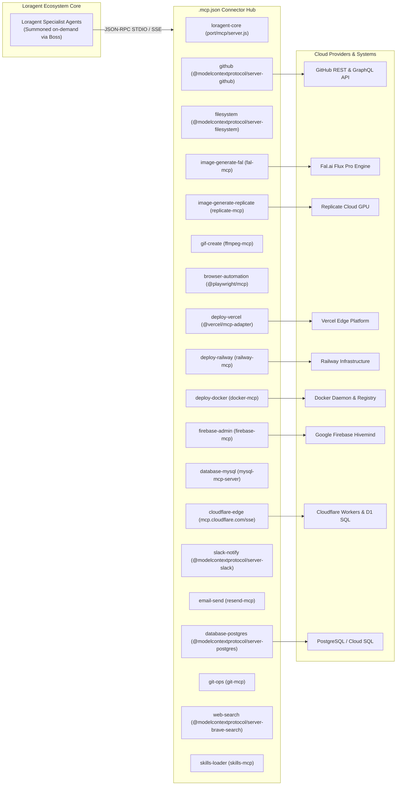
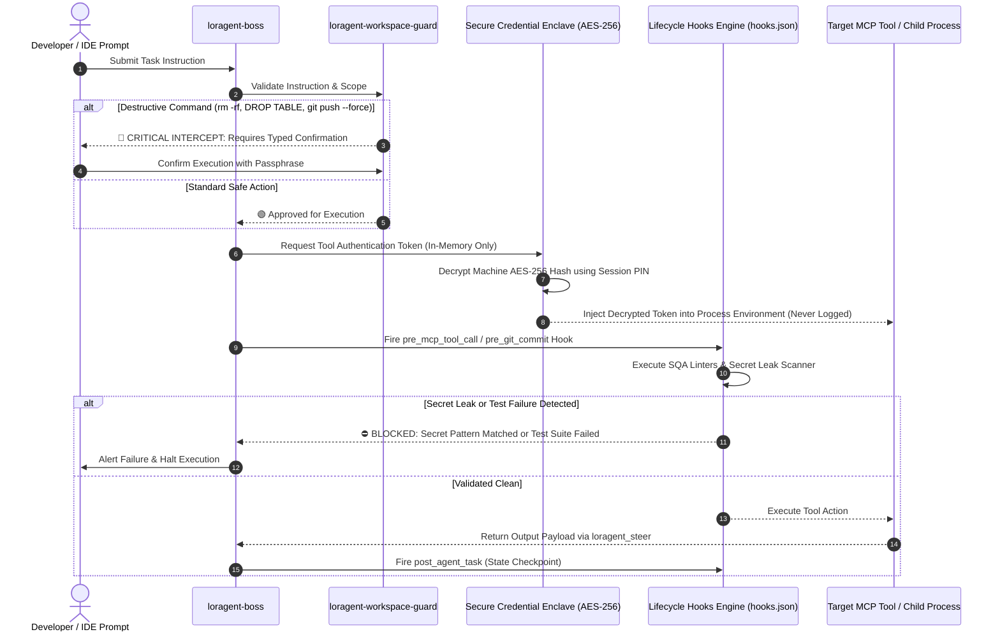
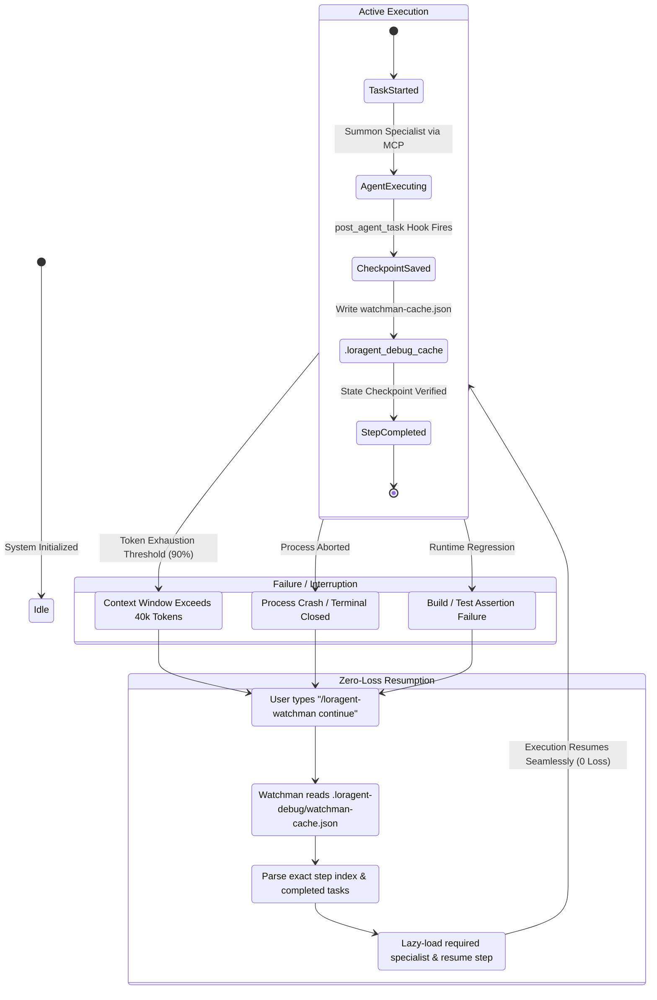
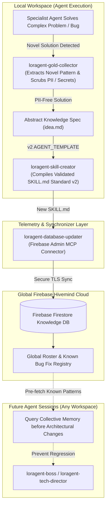

<div align="center">
  
# 🤖 Loragent Universal Multi-Agent Ecosystem (v2.0)

**The Universal, Enterprise-Grade Multi-Agent Orchestration Framework & 250-Resource AI Marketplace**

*Transform single-agent IDEs (Cursor, Claude Code, Windsurf, Antigravity, Roo Code, Cline, Zed, Codex) into a deterministic 224+ specialist software firm.*

[](https://loragent.lorapok.tech)
[]()
[](registry/marketplace.json)
[]()
[](LICENSE)

</div>

---

## 📑 Table of Contents
1. [Architecture at a Glance (4-Layer Standard)](#-the-4-layer-architecture-standard)
2. [Comprehensive Mermaid Architecture Diagrams](#-comprehensive-system-architecture-diagrams)
   - [1. Universal Multi-IDE Routing & Execution Topology](#1-universal-multi-ide-routing--execution-topology)
   - [2. The 6 Dynamic Squad Formations & Spidernet DAG](#2-the-6-dynamic-squad-formations--spidernet-dag)
   - [3. 19+ MCP Connector Topology & Edge Mesh](#3-19-mcp-connector-topology--edge-mesh)
   - [4. Zero-Trust Enclave & Lifecycle Intercept Guardrails](#4-zero-trust-enclave--lifecycle-intercept-guardrails)
   - [5. Crash Recovery & Ephemeral State Lifecycle](#5-crash-recovery--ephemeral-state-lifecycle)
   - [6. Continuous Hivemind Learning & Knowledge Pipeline](#6-continuous-hivemind-learning--knowledge-pipeline)
3. [All Edge Cases & Resilience Matrix](#-edge-cases--resilience-matrix)
4. [File Type Reference & Multi-IDE Support](#-file-type-reference--multi-ide-support)
5. [The 6 Formation Squad Presets](#-the-6-formation-squad-presets)
6. [Tool Installation & Dependency Protocol](#-tool-installation--dependency-protocol)
7. [Slash Command Quick Reference](#-slash-command-quick-reference)
8. [Quickstart & Automation Pipeline](#-quickstart--automation-pipeline)

---

## 🏛️ The 4-Layer Architecture Standard

Loragent standardizes multi-agent development across all 28+ AI IDEs through 4 clear operational layers:

```
┌───────────────────────────────────────────────────────────────────────────────┐
│ LAYER 1 — Project Root (All Editors)                                          │
│ AGENTS.md · CLAUDE.md · AGENT_TEMPLATE.md · .mcp.json · .windsurfrules ·      │
│ .clinerules · .roomodes                                                       │
├───────────────────────────────────────────────────────────────────────────────┤
│ LAYER 2 — Editor-Specific Rules & Plugins                                     │
│ .kiro/steering/*.md · .cursor/rules/*.mdc · .claude-plugin/plugin.json ·      │
│ hooks/hooks.json (8 Enterprise Lifecycle Hooks)                               │
├───────────────────────────────────────────────────────────────────────────────┤
│ LAYER 3 — Skills & Agent Personas (224+ Agents / Skills)                      │
│ Permanent Residents: boss · spidernet · teacher · watchman · workspace-guard  │
│ Specialized Squads: image-generate · gif-create · deploy · tools-install ·    │
│ frontend-se · backend-se · sqa · devops · wrangler-specialist · etc.         │
├───────────────────────────────────────────────────────────────────────────────┤
│ LAYER 4 — Automation & Tooling Pipeline                                       │
│ scripts/enrich-skills.js v2 · scripts/bootstrap-standard.sh ·                 │
│ scripts/generate-marketplace.js · bin/loragent-email.js · sdk/formations.js   │
└───────────────────────────────────────────────────────────────────────────────┘
```

---

## 📊 Comprehensive System Architecture Diagrams

### 1. Universal Multi-IDE Routing & Execution Topology

```mermaid
flowchart TB
    subgraph IDE_LAYER["Universal AI IDE & Client Layer (28+ Editors)"]
        direction TB
        CC["Claude Code<br/>(CLAUDE.md)"]
        CUR["Cursor IDE<br/>(.cursor/rules/*.mdc)"]
        KIR["Kiro IDE<br/>(.kiro/steering/*.md)"]
        WIN["Windsurf Cascade<br/>(.windsurfrules)"]
        CLI["Cline / Roo Code<br/>(.clinerules / .roomodes)"]
        AGY["Antigravity IDE<br/>(mcp_config.json)"]
        ZED["Zed / Codex / Devin<br/>(AGENTS.md)"]
    end

    subgraph ENTRY_ORCHESTRATOR["Layer 1 & Layer 3: Supreme Orchestration Entry Point"]
        BOSS["loragent-boss<br/>(Central Intelligent Router)"]
        TEACHER["loragent-teacher<br/>(Prompt Normalization & Requirements Clarifier)"]
        GUARD["loragent-workspace-guard<br/>(Zero-Trust Security & Destructive I/O Enforcer)"]
        WATCHMAN["loragent-watchman<br/>(Session State Sentinel & Token Cache)"]
    end

    subgraph FORMATIONS["The 6 Dynamic Squad Matrices"]
        direction TB
        F_AUTO["Auto Team Matrix<br/>(Tech Director, Backend, Frontend, SQA, CI/CD)"]
        F_OFFICE["Enterprise Office Matrix<br/>(Coordinator, Marketing, Publisher, PR)"]
        F_CHELA["Chela Debugging Matrix<br/>(Bug Hunter, Shift Eng, Debugger, Inspector)"]
        F_FREELANCE["Freelance Isolation Matrix<br/>(Fal.ai Image, FFmpeg GIF, Wrangler, 3D)"]
        F_OBSERVER["Observer Sentinel Matrix<br/>(Watchman, Guard, Cache Collector, Gold Collector)"]
        F_SPIDER["Spidernet DAG Matrix<br/>(Parallel Execution for &ge;5 Agents)"]
    end

    subgraph MCP_EDGE["Layer 3 & 4: MCP Connectors & Zero-Trust Execution Mesh"]
        CORE_MCP["loragent-core MCP<br/>(summon / dismiss / steer / hook / save)"]
        CLOUD_EDGE["Cloudflare Edge MCP<br/>(Workers AI, D1 SQL, R2, Vectorize)"]
        CREATIVE_MCP["Creative MCPs<br/>(Fal.ai Flux Pro, Replicate, FFmpeg)"]
        INFRA_MCP["Deployment MCPs<br/>(Vercel, Railway, Docker, Playwright)"]
        DATA_MCP["Database MCPs<br/>(PostgreSQL, Firebase Firestore, MySQL)"]
    end

    IDE_LAYER -->|Dispatches Directive| BOSS
    BOSS <-->|Clarifies Scope| TEACHER
    BOSS <-->|Validates Security Rules| GUARD
    BOSS <-->|Saves Checkpoints| WATCHMAN

    BOSS -->|Routes via loragent_steer| F_AUTO
    BOSS -->|Routes via loragent_steer| F_OFFICE
    BOSS -->|Routes via loragent_steer| F_CHELA
    BOSS -->|Routes via loragent_steer| F_FREELANCE
    BOSS -->|Routes via loragent_steer| F_OBSERVER
    BOSS -->|Delegates parallel DAG| F_SPIDER

    F_AUTO & F_OFFICE & F_CHELA & F_FREELANCE & F_OBSERVER & F_SPIDER -->|Calls Tools| CORE_MCP
    CORE_MCP <--> CLOUD_EDGE & CREATIVE_MCP & INFRA_MCP & DATA_MCP
```



---

### 2. The 6 Dynamic Squad Formations & Spidernet DAG

```mermaid
graph TD
    subgraph BOSS_NODE["loragent-boss (Orchestrator Entry)"]
        B["loragent-boss"]
    end

    subgraph AUTO_TEAM["1. Auto Team Formation (Engineering)"]
        TD["loragent-tech-director<br/>(Chief Architect & Task Breakdown)"]
        BE["loragent-backend-se<br/>(REST APIs, DB Models, Zod Validation)"]
        FE["loragent-frontend-se<br/>(Biological UI, Framer Motion, Next.js)"]
        QA["loragent-sqa<br/>(Automated Unit/E2E Suites, Security Audit)"]
        CI["loragent-cicd-specialist<br/>(GitHub Actions, Docker Build, Release Gates)"]
        
        TD -->|API Spec & Types| BE
        TD -->|UI Design Contract| FE
        BE & FE -->|Implementation Code| QA
        QA -->|Verified Artifacts| CI
    end

    subgraph OFFICE_TEAM["2. Enterprise Office Formation (Business)"]
        PC["loragent-project-coordinator<br/>(Milestone Roadmap & Delivery Sync)"]
        MM["loragent-marketing-strategy-manager<br/>(Campaign Strategy & Social Hooks)"]
        PB["loragent-publisher<br/>(Release Notes, Docs, Store Submission)"]
        PR["loragent-pr-specialist<br/>(Public Relations & Slack/Email Outreach)"]

        PC --> MM --> PB --> PR
    end

    subgraph CHELA_TEAM["3. Chela Debugging Formation (Zero-Guess)"]
        BH["loragent-bug-hunter<br/>(Parses orchestration-graph.json Telemetry)"]
        SE["loragent-shift-engineer<br/>(Applies Minimal Verified Hotfix)"]
        DB["loragent-debugger<br/>(Runs Regression Suites & Assertions)"]
        IN["loragent-inspector<br/>(Root Cause Analysis Report)"]

        BH -->|Locates Line & Fault| SE -->|Patched Code| DB -->|Validation Report| IN
    end

    subgraph FREELANCE_TEAM["4. Freelance Isolation Formation (Specialists)"]
        IMG["loragent-image-generate<br/>(Fal.ai Flux Pro / Replicate SDXL)"]
        GIF["loragent-gif-create<br/>(FFmpeg Video/GIF + Gifsicle Optimization)"]
        DEP["loragent-deploy<br/>(Vercel / Railway / Docker Staging & Prod)"]
        INS["loragent-tools-install<br/>(Auto Check -> Install -> Verify Engine)"]
        WRG["loragent-wrangler-specialist<br/>(Cloudflare Workers / D1 / KV / R2)"]
    end

    subgraph OBSERVER_TEAM["5. Observer & Sentinel Formation (Recovery)"]
        WM["loragent-watchman<br/>(State Sentinel .loragent-debug/watchman-cache.json)"]
        WG["loragent-workspace-guard<br/>(Blocks Destructive Commands)"]
        CC_PRUNE["loragent-cache-collector<br/>(Token Sniper AST Context Pruning)"]
        GC["loragent-gold-collector<br/>(Extracts Novel Solutions & Removes PII)"]
        SC["loragent-skill-creator<br/>(Generates New SKILL.md for Hivemind)"]

        WM <--> WG
        WM --> CC_PRUNE
        GC --> SC
    end

    subgraph SPIDERNET_TEAM["6. Spidernet Parallel DAG Coordinator (&ge;5 Agents)"]
        SN["loragent-spidernet<br/>(Parallel DAG Matrix Coordinator)"]
        N1["Parallel Worker 1"]
        N2["Parallel Worker 2"]
        N3["Parallel Worker N..."]
        AGG["Result Aggregator & Consensus Gate"]

        SN --> N1 & N2 & N3 --> AGG
    end

    B -->|/loragent-boss auto| AUTO_TEAM
    B -->|/loragent-boss office| OFFICE_TEAM
    B -->|/loragent-boss chela| CHELA_TEAM
    B -->|/loragent:<specialist>| FREELANCE_TEAM
    B -->|/loragent-watchman continue| OBSERVER_TEAM
    B -->|Task > 5 Parallel Agents| SPIDERNET_TEAM
```



---

### 3. 19+ MCP Connector Topology & Edge Mesh



---

### 4. Zero-Trust Enclave & Lifecycle Intercept Guardrails



---

### 5. Crash Recovery & Ephemeral State Lifecycle



---

### 6. Continuous Hivemind Learning & Knowledge Pipeline



---

## 🛡️ Edge Cases & Resilience Matrix

Loragent implements deterministic safety handlers for every operational edge case:

| Scenario / Corner Case | Root Cause / Trigger | Autonomous Mitigation & Resolution Protocol |
|---|---|---|
| **1. Token Window Exhaustion** | Context length > 40k tokens | `loragent-cache-collector` activates AST token sniper to prune dead context; `loragent-watchman` flushes full execution graph to `.loragent-debug/watchman-cache.json`; non-resident agents are dismissed, retaining only the 5 core operators. |
| **2. Destructive Bash Command** | `rm -rf`, `DROP TABLE`, `git push --force` | `loragent-workspace-guard` intercepts child process execution; blocks execution immediately; mandates human explicit authorization with passphrase before proceeding. |
| **3. Fal.ai Image Provider Outage** | Primary image generation endpoint rate-limited or unavailable | `loragent-image-generate` automatically falls back to `image-generate-replicate` MCP (Flux Dev / SDXL) with zero prompt disruption. |
| **4. Missing CLI Tool / Binary** | System lacks `ffmpeg`, `gifsicle`, `playwright`, `vercel` | `loragent-tools-install` executes the **check &rarr; install &rarr; verify** protocol (`npx -y` zero-install first, local dev dependency second, auto-rollback on fail). |
| **5. Secret Leak in Agent Output** | Code or terminal output contains API key or credential pattern | `secret-leak-guard` hook executes regex AST scanning on `pre_agent_output`; blocks response before rendering; sanitizes output with `[ENCRYPTED_VAULT_SECRET]`. |
| **6. Staging / Production Deployment Failure** | Container build error or test failure | `pre-deploy-verify` hook runs automated SQA suites; on test failure, deployment is blocked and routed to `loragent-bug-hunter` with `orchestration-graph.json` diagnostics. |
| **7. Multi-Agent Deadlock (&ge;5 agents)** | Complex dependency circular wait | `loragent-boss` delegates routing to `loragent-spidernet` DAG orchestrator, managing explicit asynchronous locks and parallel resolution. |
| **8. Sudden Terminal Crash / Kill** | IDE closed unexpectedly or power outage | Next session launches with `/loragent-watchman continue`; state engine parses step checkpoint and resumes with 100% data integrity. |

---

## 📁 File Type Reference & Multi-IDE Support

Loragent provides universal multi-IDE synchronization. All 224+ agents and skills are mirrored to native editor formats:

| File / Location | Format | Compatible Editors | Scope |
|---|---|---|---|
| `AGENTS.md` | Plain Markdown | **28+ AI IDEs** (Cursor, Windsurf, Devin, Zed, Codex, Antigravity, Amp) | Project-wide, always loaded (<35 lines) |
| `CLAUDE.md` | Markdown (`@AGENTS.md`) | **Claude Code** | Root memory layer, skill shortcuts, token limits |
| `AGENT_TEMPLATE.md` | Markdown + YAML | All agents & skills | Canonical v2 specification schema |
| `.mcp.json` | JSON Schema | **Claude Code, Cursor, Antigravity, Kiro, Codex** | 19+ MCP connector definitions |
| `.cursor/rules/*.mdc` | MDC Markdown | **Cursor IDE** | Glob-scoped rules (`lorapok-core`, `face`, `deploy`) |
| `.kiro/steering/*.md` | Markdown + YAML | **Kiro IDE** | Steering modes (`always`, `auto`, `fileMatch`) |
| `.windsurfrules` | Plain Markdown | **Windsurf Cascade** | Actionable project directives & LLDP layers |
| `.clinerules` | Plain Markdown | **Cline** | Tool execution standards & zero-trust rules |
| `.roomodes` | JSON | **Roo Code** | Custom modes (`loragent-boss`, `auto-team`, `chela`, etc.) |
| `hooks/hooks.json` | Loragent Hooks JSON | **Claude Code Plugin & MCP Engine** | 8 Enterprise lifecycle hooks |
| `.claude-plugin/plugin.json` | JSON | **Claude Code Plugin Marketplace** | Universal bundle descriptor |

---

## ⚡ The 6 Formation Squad Presets

| Formation | Lead Agent | Active Squad Members | Primary Objective |
|---|---|---|---|
| **Boss Orchestrator** | `loragent-boss` | `boss`, `teacher`, `workspace-guard`, `watchman`, `spidernet` | Evaluates prompt complexity, manages cross-agent steering, and enforces safety boundaries. |
| **Auto Team Matrix** | `loragent-tech-director` | `tech-director`, `backend-se`, `frontend-se`, `sqa`, `cicd-specialist` | Full-stack software engineering from architecture to biological UI and automated releases. |
| **Enterprise Office** | `loragent-project-coordinator` | `project-coordinator`, `marketing-strategy-manager`, `publisher`, `pr-specialist` | Business roadmaps, product initialization, press releases, and marketing campaigns. |
| **Chela Debugging** | `loragent-bug-hunter` | `bug-hunter`, `shift-engineer`, `debugger`, `inspector`, `repo-repair` | Telemetry-driven root cause analysis, regression fixes, and self-healing patches. |
| **Freelance Isolation** | `loragent-image-generate` | `image-generate`, `gif-create`, `deploy`, `tools-install`, `wrangler-specialist` | Singular domain tasks (Flux Pro AI art, FFmpeg GIFs, Cloudflare Workers, package installs). |
| **Observer & Sentinel** | `loragent-watchman` | `watchman`, `workspace-guard`, `cache-collector`, `gold-collector`, `skill-creator` | State caching, crash recovery, token sniper AST pruning, and Firebase hivemind synchronization. |

---

## 🔧 Tool Installation & Dependency Protocol

Every agent follows the **check &rarr; install &rarr; verify** standard before executing any tool:

```bash
# 1. CHECK — Never assume a tool is available
command -v <tool> 2>/dev/null && echo "FOUND" || echo "NOT_FOUND"

# 2. INSTALL — Select the least invasive scope
npx -y <pkg>@latest [args]          # Zero-install (Preferred for CLI utilities)
npm install --save-dev <pkg>        # Project Dev Dependency
uv pip install <pkg>                # Python fast virtual environment
composer require <vendor>/<pkg>     # PHP Laravel packages

# 3. VERIFY — Confirm operational readiness
<tool> --version && echo "READY" || (echo "INSTALLATION FAILED" && exit 1)
```

---

## ⌨️ Slash Command Quick Reference

| Command | Action / Effect | Triggered Formation |
|---|---|---|
| `/loragent:boss auto` | Force Auto Team engineering squad | `Tech Director` &rarr; `Backend` &rarr; `Frontend` &rarr; `SQA` &rarr; `CI/CD` |
| `/loragent:boss chela` | Force Chela zero-guess debugging squad | `Bug Hunter` &rarr; `Shift Engineer` &rarr; `Debugger` &rarr; `Inspector` |
| `/loragent:boss office` | Force Enterprise Office business squad | `Coordinator` &rarr; `Marketing` &rarr; `Publisher` &rarr; `PR` |
| `/loragent autopilot [task]` | Universal autonomous execution loop | Boss selects optimal squad and validates with `check-done` |
| `/loragent-watchman continue` | Instant crash recovery from checkpoint | Resumes from `.loragent-debug/watchman-cache.json` (0 loss) |
| `/loragent-teacher clarify` | Strict requirements clarification phase | Teacher interviews user before architecture begins |
| `/loragent-inspector rca` | Detailed Root Cause Analysis | Produces structured RCA diagnosis report |
| `/loragent:image-generate` | Direct AI image generator | Fal.ai Flux Pro (primary) / Replicate (fallback) |
| `/loragent:gif-create` | Direct animated GIF producer | FFmpeg + Gifsicle palettegen optimization |
| `/loragent:deploy` | Direct multi-cloud deployment | Vercel (frontend), Railway (backend), Docker (containers) |
| `/loragent:tools-install` | Universal package & tool resolver | Auto-detects package managers and installs missing binaries |

---

## 🚀 Quickstart & Automation Pipeline

### 1. One-Shot Repository Bootstrap
```bash
# Bootstrap all 4 layers into any repository:
bash scripts/bootstrap-standard.sh --dry-run
# Execute the bootstrap:
bash scripts/bootstrap-standard.sh
```

### 2. Mass Enrichment & Multi-IDE Compilation
```bash
# 1. Scan and extract all agent manifests:
node scripts/enrich-skills.js --extract

# 2. Compile enriched SKILL.md files and emit Cursor/Kiro mirrors:
node scripts/enrich-skills.js --compile --mirrors

# 3. Regenerate agent index documentation:
node scripts/enrich-skills.js --agent-index

# 4. Validate schema compliance:
node scripts/enrich-skills.js --validate
```

### 3. Run Verification Test Suite
```bash
npm test
```

---

<div align="center">

**Loragent Universal Standard v2.0** • *Crafted by [Lorapok Labs](https://lorapok.tech)* • [Online Marketplace](https://loragent.lorapok.tech)

</div>
