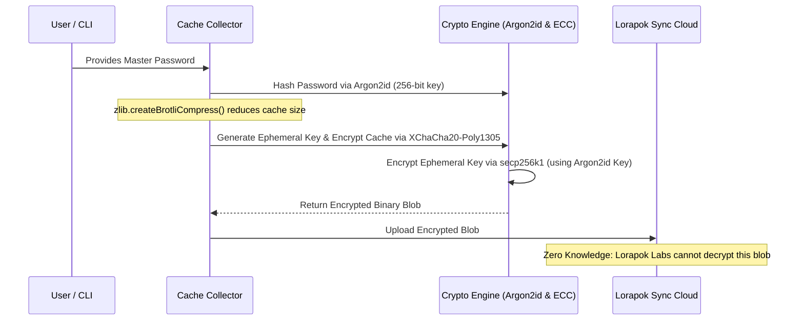

# Lorapok Labs - Administrator Wiki

This document serves as the master reference for the internal architecture, security protocols, and business modeling of the Lorapok ecosystem.

---

## 1. Web3 End-to-End Encryption (E2EE) Sync Protocol

The `loragent-cache-collector` utilizes a military-grade, Zero-Knowledge protocol to compress and sync IDE caches (e.g., Cursor) to the cloud. Developers at Lorapok Labs have absolutely zero access to user files.

### Encryption Architecture Flow

---

## 2. Market Data Analysis: AI Coding Assistants

Lorapok Labs operates in the rapidly expanding AI Coding Assistant market, competing with tools like GitHub Copilot, Cursor, and Claude Code. Our unique differentiator is the **Lorapok Pro** subscription, featuring the Token Sniper.

### Market Demographics
- **Total Addressable Market (TAM)**: ~30 Million professional software developers globally.
- **Serviceable Addressable Market (SAM)**: ~10 Million developers actively adopting AI tools in their daily workflow.
- **Target Audience**: Power users, senior engineers, and agencies who frequently hit context token limits (e.g., Anthropic API limits, Cursor Pro limits).

### The Problem (Pain Point)
Power users burn through 50,000 to 100,000 tokens per complex query because standard AI editors feed raw, massive files into the context window. This leads to rate-limiting and exorbitant API costs.

### The Solution: Lorapok Token Sniper
Our premium `loragent-token-sniper` agent guarantees a **>70% reduction in context usage** by pruning Abstract Syntax Trees (AST) and serving diff-only memory.

### Financial Projections (Year 1)
- **Assumed Conversion Rate**: 1% of the 100,000 users who try our 14-day giveaway.
- **Paid Subscribers**: 1,000 active Lorapok Pro users.
- **Monthly Recurring Revenue (MRR)**: 1,000 users * $14.99/month = $14,990 MRR.
- **Annual Run Rate (ARR)**: ~$180,000.
- **Enterprise Upsell**: By capturing just 10 agency teams (20 seats each at $49.99), we add an additional $120,000 to the ARR.

### Go-To-Market (GTM) Strategy
1. **The Hook**: Launch the "LorapokToon" security advertisements across X (Twitter), LinkedIn, and Reddit. 
2. **The Offer**: "Stop hitting AI rate limits. Cut token costs by 70%. Free 14-day Pro License for a Retweet."
3. **The Lock-In**: Once developers experience a perfectly smooth workflow without token starvation, they convert to the $14.99/mo subscription.
