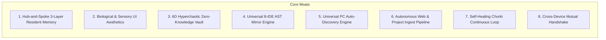

# 📚 Loragent Master Wiki & Universal Architecture Manual

> **Lorapok Labs Official Technical Reference & Operations Manual**  
> *Universal 224-Agent Virtual Software Firm, Hub-and-Spoke Topology & Multi-IDE Orchestration System*  
> **Version:** 2.0.0 | **Catalog Size:** 250 Items (224 Agents, 20 MCPs, 6 Squad Formations) | **Protocol:** LLDP-5

---

## 📑 Table of Contents

1. [System Overview & Key Metrics](#1-system-overview--key-metrics)
2. [LLDP 5-Layer Architecture](#2-lldp-5-layer-architecture)
3. [The 6 Squad Formations](#3-the-6-squad-formations)
4. [Master CLI Commands & Tooling](#4-master-cli-commands--tooling)
5. [Universal PC Discovery & Stack Analyzer](#5-universal-pc-discovery--stack-analyzer)
6. [Web Ingest & Artifact Factory Pipeline](#6-web-ingest--artifact-factory-pipeline)
7. [MCP Server Registry & Cloudflare Edge](#7-mcp-server-registry--cloudflare-edge)
8. [Zero-Trust Security & Pre-Push Encryption](#8-zero-trust-security--pre-push-encryption)
9. [Multi-IDE Synchronization & Compatibility](#9-multi-ide-synchronization--compatibility)
10. [Verification, Telemetry & Watchman Recovery](#10-verification-telemetry--watchman-recovery)
11. [Proprietary Uniques & Structural Innovations (The Loragent Moat)](#11-proprietary-uniques--structural-innovations-the-loragent-moat)

---

## 1. System Overview & Key Metrics

Loragent is an autonomous virtual software engineering and operations firm. Operating on a **Hub-and-Spoke topology**, `loragent-boss` serves as the central intelligent routing hub, dynamically summoning specialists and dissolving context to operate within strict token budgets.

```mermaid
graph TD
    User([User Request / Slash Command]) --> Boss[loragent-boss / Orchestrator]
    Boss --> Teacher[loragent-teacher (Requirements Clarifier)]
    Teacher --> Formations{Select Formation Squad}
    
    Formations -->|Software Engineering| AutoTeam[Auto Team Squad Matrix]
    Formations -->|Business & PR| Office[Enterprise Office Squad]
    Formations -->|Debugging & RCA| Chela[Chela Debugger Squad]
    Formations -->|Specialized Solo| Freelance[Freelance Domain Experts]
    Formations -->|DAG Workflows| Spidernet[Spidernet Parallel DAG]
    Formations -->|Session Recovery| Observer[Watchman Recovery & Cache]

    AutoTeam --> MCP[Native & Edge MCP Server JSON-RPC]
    Office --> MCP
    Chela --> MCP
    Freelance --> MCP
    Spidernet --> MCP
    Observer --> MCP
```

### 📊 Ecosystem Inventory Matrix
* **Total Marketplace Items**: **250**
* **Autonomous Agents & Skills**: **224**
* **Native Model Context Protocol (MCP) Servers**: **20**
* **Formation Squad Presets**: **6**
* **Supported IDEs**: Cursor, Claude Code, Antigravity/Gemini, Windsurf, VS Code, Roo Code, Cline, Kiro.
* **Test Suites**: **44 Passing Suites (100% Green)**.

---

## 2. LLDP 5-Layer Architecture

The codebase adheres strictly to the **Lorapok Labs Design Pattern (LLDP)**:

| Layer | Directory | Purpose | Core Files & Modules |
|---|---|---|---|
| **FACE** | `face/cli/` | User-facing Command Line Interface (Commander.js), Autopilot triggers, interactive prompts | `face/cli/index.js`<br>`face/cli/commands/*.js`<br>`face/cli/autopilot.js` |
| **PULSE** | `pulse/daemon/` | Background processes, file watchers, process heartbeats, and state synchronizers | `pulse/daemon/state-watcher.js` |
| **LORE** | `lore/` | Domain intelligence, PC discovery, project tech stack analysis, and data models | `lore/services/pc-discovery.js`<br>`lore/services/project-analyzer.js`<br>`lore/models/agent.js` |
| **PORT** | `port/mcp/` | External communication, stdio JSON-RPC MCP server, Cloudflare Workers MCP edge gateway | `port/mcp/server.js`<br>`port/mcp-cloudflare/src/index.js` |
| **LOOM** | `loom/` | Dependency Injection container, multi-agent steering, DAG orchestration, and workflows | `loom/di.js`<br>`loom/steer/`<br>`loom/workflows/` |

---

## 3. The 6 Squad Formations

Loragent organizes its 224 agents into 6 specialized operational formations stored in `formations/*.json`:

```
formations/
├── auto-team.json            # Software engineering squad
├── office.json               # Business, marketing, legal, PR squad
├── freelance-isolation.json  # Specialist solo experts
├── chela-debugger.json       # RCA, bug triage, VCS repair squad
├── observer-recovery.json    # Watchman state cache & fault tolerance
└── orchestrator.json         # Spidernet parallel DAG coordinator
```

### 1. 🟢 Auto Team Matrix (`auto-team.json`)
* **Lead Agent:** `loragent-tech-director`
* **Core Squad:** `loragent-backend-se`, `loragent-frontend-se`, `loragent-sqa`, `loragent-devops`, `loragent-cicd-specialist`, `loragent-chorki`.
* **Objective:** Full-stack software architecture, API design, biological UI/UX, automated testing, and CI/CD pipelines.

### 2. 🏢 Enterprise Office Matrix (`office.json`)
* **Lead Agent:** `loragent-project-coordinator`
* **Core Squad:** `loragent-project-manager`, `loragent-marketing-strategy-manager`, `loragent-publisher`, `loragent-pr-specialist`, `loragent-hr`, `loragent-sales-executive`.
* **Objective:** Product roadmaps, launch PR, copy generation, marketing strategies, and store submissions.

### 3. 🔧 Freelance Isolation (`freelance-isolation.json`)
* **Lead Agent:** `loragent-boss`
* **Specialists:** 140+ targeted experts (`loragent-3d-designer`, `loragent-logo-designer`, `loragent-fastapi`, `loragent-wrangler-specialist`, `loragent-rust-expert`, etc.).
* **Objective:** Single-responsibility tasks loaded on-demand and dismissed immediately to conserve tokens.

### 4. 🔴 Chela Debugging Protocol (`chela-debugger.json`)
* **Lead Agent:** `loragent-bug-hunter`
* **Core Squad:** `loragent-shift-engineer`, `loragent-git-specialist`, `loragent-debugger`, `loragent-inspector`.
* **Objective:** Deep telemetry parsing, regression debugging, VCS conflicts, and root cause analysis (RCA).

### 5. 👁️ Observer & Recovery Protocol (`observer-recovery.json`)
* **Lead Agent:** `loragent-watchman`
* **Core Squad:** `loragent-workspace-guard`, `loragent-token-sniper`, `loragent-cache-collector`.
* **Objective:** Checkpointing session state in `.loragent-debug/watchman-cache.json`, AST context pruning, and crash recovery.

### 6. 🕸️ Spidernet DAG Matrix (`orchestrator.json`)
* **Lead Agent:** `loragent-spidernet`
* **Core Squad:** `loragent-teacher`, `loragent-boss`, `loragent-pipeline-checker`.
* **Objective:** Non-linear Directed Acyclic Graph (DAG) task execution and parallel agent workflows.

---

## 4. Master CLI Commands & Tooling

Loragent provides a unified CLI available globally via `loragent` or `node face/cli/index.js`:

```bash
# ── Asset Discovery & System Inventory ───────────────────────
loragent discover                     # Scans PC for all AI assets & writes pc-inventory.json
loragent discover --json              # Outputs raw JSON inventory

# ── Tech Stack Analysis & Squad Recommendation ───────────────
loragent analyze .                    # Analyzes current workspace
loragent analyze /path/to/project     # Analyzes target directory
loragent analyze https://github.com/org/repo  # Clones & analyzes remote repo

# ── Universal IDE Mirror Synchronization ─────────────────────
loragent sync                         # Synchronizes MCP, skills, rules to all IDEs

# ── Web Ingest & Artifact Generation ─────────────────────────
node scripts/ingest-url.js --url https://docs.stripe.com
node scripts/generate-artifact.js --type skill --name loragent-stripe
node scripts/generate-artifact.js --type bundle --spec ./specs/my-spec.json

# ── Marketplace & Roster Management ─────────────────────────
node scripts/generate-marketplace.js  # Updates registry/marketplace.json & AGENT_INDEX.md
node scripts/enrich-skills.js --compile --mirrors  # Compiles all IDE mirrors

# ── Autopilot & Server ───────────────────────────────────────
loragent autopilot "Build a REST API with authentication"
loragent server                       # Starts native stdio MCP server
```

---

## 5. Universal PC Discovery & Stack Analyzer

### `PCDiscovery` Engine (`lore/services/pc-discovery.js`)
Scans 12+ root locations across the machine, parsing:
* `SKILL.md` frontmatter from `.gemini/config/`, `.cursor/`, `.claude/`, `.agents/`, `.kiro/`, `.skills/`, `.codeium/`.
* `mcp.json` / `mcp_config.json` JSON-RPC tool endpoints.
* `.mdc` rules, `AGENTS.md`, `.cursorrules`, `.clinerules`, `.windsurfrules`.
* `.roomodes` custom mode configurations.
* Outputs consolidated telemetry to `registry/pc-inventory.json`.

### `ProjectAnalyzer` Engine (`lore/services/project-analyzer.js`)
Automatically inspects:
* **Node/TS:** `package.json`, `tsconfig.json` $\rightarrow$ React, Vue, Next.js, Express, Fastify, Tailwind, Prisma, Vitest.
* **Python:** `requirements.txt`, `pyproject.toml`, `Pipfile` $\rightarrow$ FastAPI, Django, Flask.
* **Rust:** `Cargo.toml` $\rightarrow$ Rust microservices and native modules.
* **PHP:** `composer.json` $\rightarrow$ Laravel framework and package dependencies.
* **Cloud & Infra:** `Dockerfile`, `docker-compose.yml`, `wrangler.toml`, `wrangler.jsonc` $\rightarrow$ Docker, Cloudflare Workers.

---

## 6. Web Ingest & Artifact Factory Pipeline

### `scripts/ingest-url.js`
1. **Fetch**: Retrieves HTML / Markdown / API definitions from any remote URL.
2. **Analyze**: Extracts tools, parameters, CLI commands, prerequisites, and authentication models via Claude API (with deterministic fallback parser).
3. **Generate**: Emits standard `SKILL.md`, `mcp-fragment.json`, `.kiro/steering/<slug>.md`, and `.cursor/rules/<slug>.mdc`.
4. **Register**: Auto-indexes the newly created artifact into `registry/marketplace.json`.

### `scripts/generate-artifact.js`
Generates artifacts conforming to `templates/artifact-spec.schema.json` across 7 modes:
* `skill` — Full SKILL.md with 7 standardized sections.
* `agent` — Agent specification with execution matrix.
* `mcp` — Standalone MCP connector definition.
* `steering` — Kiro IDE `#` steering rule.
* `rule` — Cursor `.mdc` rule.
* `formation` — Squad preset JSON.
* `bundle` — Complete artifact package.

---

## 7. MCP Server Registry & Cloudflare Edge

Loragent exposes all tools through the **Model Context Protocol (MCP)**:

### Local stdio Server (`port/mcp/server.js`)
```json
{
  "mcpServers": {
    "loragent-core": {
      "command": "node",
      "args": ["/mnt/NewVolume/Personal_Projects/loragent/port/mcp/server.js"],
      "env": {
        "LORAGENT_WORKSPACE": "/mnt/NewVolume/Personal_Projects/loragent"
      }
    }
  }
}
```

### Core MCP Tools Exposed
* `loragent_list_agents` — Query agents by formation, category, layer, or tags.
* `loragent_summon_agent` — Mounts specialist instructions dynamically into context.
* `loragent_dismiss_agent` — Unmounts specialist when task finishes.
* `loragent_steer` — Formal, logged handoff between pipeline agents.
* `loragent_trigger_hook` — Executes lifecycle events (`pre-commit`, `check-done`, `post-task`).
* `loragent_watchman_save` — Checkpoints execution context and step state.
* `loragent_get_state` — Retrieves active formation and error telemetry.

---

## 8. Zero-Trust Security & Pre-Push Encryption

Loragent strictly enforces a **Zero-Trust Plaintext Secret Policy**:
* **Vault Storage**: All machine credentials and API tokens are secured via the TiTi Cryptographic Vault (`cred`).
* **Pre-Commit Security Guard**: [`scripts/git-protect-hook.sh`](file:///mnt/NewVolume/Personal_Projects/cred/scripts/git-protect-hook.sh) intercepts commits, blocking unencrypted `.env`, `credentials.json`, `.pem`, and private keys.
* **Pre-Push Minification & Encryption Engine**: [`scripts/protect-and-minify.mjs`](file:///mnt/NewVolume/Personal_Projects/cred/scripts/protect-and-minify.mjs) minifies code and seals it in AES-256-GCM / 6D Hyperchaotic `.titi.enc` binary containers prior to remote push.
* **Local Plain Source Protection**: Clean source code remains safely stored in `.local_plain_backup` under `.gitignore` protection.

---

## 9. Multi-IDE Synchronization & Compatibility

When running `loragent sync` or `node scripts/universal-sync.js`, the platform synchronizes assets across all major AI code editors:

| Editor | Mirror Location | Asset Types |
|---|---|---|
| **Cursor** | `.cursor/rules/*.mdc`, `.cursor/mcp.json`, `~/.cursor/` | Rules, MCP servers |
| **Claude Code / Desktop** | `CLAUDE.md`, `~/.claude/skills/`, `claude_desktop_config.json` | Skills, MCP config |
| **Antigravity / Gemini** | `~/.gemini/config/skills/`, `~/.gemini/config/mcp_config.json` | Skills, MCP servers |
| **Windsurf** | `.windsurfrules`, `~/.codeium/windsurf/mcp_config.json` | Rules, MCP servers |
| **Cline** | `.clinerules`, `cline_mcp_settings.json` | Rules, MCP servers |
| **Roo Code** | `.roomodes` (7 custom autonomous modes) | Custom Modes |
| **Kiro** | `.kiro/steering/*.md` | Steering Directives |

---

## 10. Verification, Telemetry & Watchman Recovery

* **Watchman Cache**: State continuously journaled to `.loragent-debug/watchman-cache.json`.
* **Session Resume**: `/loragent-watchman continue` restores the exact pending step without token loss.
* **Orchestration Graph**: Error state matrix tracked in `.loragent-debug/orchestration-graph.json`.
* **Automated Verification**: `npm test` runs 44 automated test suites validating specifications, schemas, formations, hooks, and SDK components.

---

## 11. 🏛️ Proprietary Uniques & Structural Innovations (The Loragent Moat)

Loragent introduces foundational innovations that distinguish it from standard agent frameworks:



### 1. 🧠 Hub-and-Spoke 3-Tier Dynamic Token Budgeting & Resident Memory Architecture
* **The Problem**: Naive agent frameworks load all skill prompts simultaneously, blowing context windows past 100k tokens and causing catastrophic hallucination.
* **The Innovation**: Loragent strictly pins **only 5 resident core agents** (`boss`, `teacher`, `spidernet`, `watchman`, `workspace-guard` $<40\text{k}$ tokens). All other 219+ domain specialists are dynamically lazy-loaded over JSON-RPC (`loragent_summon_agent`) and dissolved from memory (`loragent_dismiss_agent`) immediately upon task handoff. Memory is continuously compressed via AST diff-only pruning (`loragent-token-sniper` and `loragent-cache-collector`).

### 2. 🧬 Biological & Sensory UI Design Philosophy (FACE Layer)
* **The Problem**: Conventional AI development tools produce generic, flat, cookie-cutter Bootstrap/Tailwind interfaces.
* **The Innovation**: The Lorapok FACE design system mandates **Biological & Sensory Computing Aesthetics**:
  * **Deep Charcoal Dark Space**: Pure `#0a0a0f` obsidian base avoiding harsh pure black or washed-out greys.
  * **Lorapok Violet Neon Glow**: Signature `#7B2FBE` accent with ambient drop-shadow gradients.
  * **Glassmorphism & Depth**: Multi-layer translucent backdrops (`backdrop-filter: blur(16px)`), micro-particle reactions, and organic curved layouts.

### 3. 🔒 Zero-Knowledge 6D Hyperchaotic Cryptographic Vault (TiTi Vault Integration)
* **The Problem**: Modern repositories frequently leak API keys and private keys through `.env` files or commit histories.
* **The Innovation**: Zero plaintext credentials exist in Loragent. All secrets are secured via machine hardware-keyed AES-256-GCM, 6D Runge-Kutta hyperchaotic differential attractors, and DNA nucleotide codon diffusion. The automated `pre-push` hook minifies proprietary source code and encapsulates it inside encrypted `.titi.enc` containers prior to git push, leaving only encrypted runtime loaders in the public repository while preserving plain source code in `.local_plain_backup` under `.gitignore`.

### 4. ⚡ Universal 8-IDE Cross-Compatibility Engine (LLDP Standard)
* **The Problem**: Developers use multiple IDEs (Cursor, Claude Code, Antigravity, Windsurf, Cline, Roo Code, VS Code, Kiro), requiring manual duplication of prompts and rules across conflicting formats.
* **The Innovation**: Loragent defines a single-source-of-truth LLDP template standard. Running `loragent sync` compiles and mirrors all agent definitions to `.cursor/rules/*.mdc`, `CLAUDE.md`, `.windsurfrules`, `.clinerules`, `.roomodes`, `.kiro/steering/`, and `mcp_config.json` simultaneously in milliseconds.

### 5. 🔍 Universal PC Asset Auto-Discovery Engine (`loragent discover`)
* **The Problem**: Developers lose track of skills, prompts, and MCP configurations scattered across different global directories and tools.
* **The Innovation**: The autonomous `PCDiscovery` engine recursively scans 12+ root system paths, indexing 4,349+ skills, 57+ MCP servers, and 231+ rules into a live searchable machine inventory (`registry/pc-inventory.json`).

### 6. 🌐 Autonomous Web & Project Ingestion Pipeline (`loragent analyze` & `scripts/ingest-url.js`)
* **The Problem**: Manually writing agent configurations and MCP wrappers for external libraries is slow and error-prone.
* **The Innovation**: Loragent acts as an autonomous Oracle. Pointing `loragent analyze` or `ingest-url.js` to any web URL or repository automatically inspects polyglot codebases (Node, Python, Rust, PHP, Go, Docker), extracts tool schemas, and generates production-ready `SKILL.md` specifications, MCP connectors, and IDE rules conforming to standard schemas.

### 7. 🌀 Self-Healing Continuous Verification Loop (`loragent-chorki`)
* **The Problem**: Standard AI coding assistants stop after generating code, leaving subtle compile or runtime errors undetected.
* **The Innovation**: The `loragent-chorki` engine runs a continuous execution loop: it runs automated tests, triggers verification hooks (`check-done`), passes any failure to `loragent-inspector` for Root Cause Analysis (RCA), applies targeted hot-patches, and repeats until the implementation is 100% verified.

### 8. 🤝 Cross-Device Machine Fingerprint Handshake
* **The Problem**: Syncing developer agents across personal computers, staging servers, and team workstations typically requires centralized clouds that expose private credentials.
* **The Innovation**: Loragent supports decentralized mutual cryptographic handshakes between developer devices using hardware-backed machine signatures and zero-knowledge PIN verification.

---
*Lorapok Labs © 2026 — Universal Multi-Agent Ecosystem*
