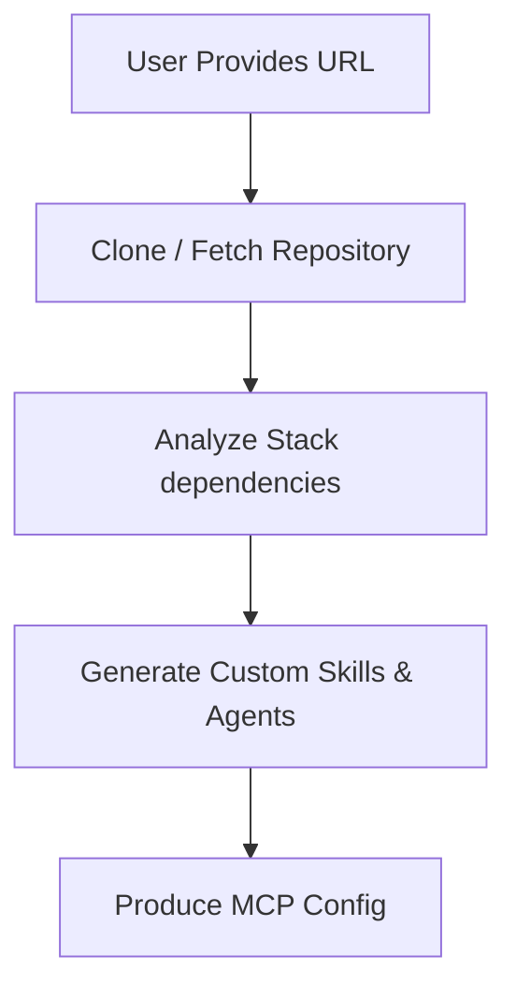

# URL Ingestion & Agent Generation Guide

Welcome to the **Loragent URL Ingestion** guide. Loragent v2.0 introduces the powerful ability to automatically ingest a remote repository, parse its technology stack, and dynamically generate custom agents, skills, and MCP configurations.

## 🚀 How It Works

The ingestion system completely automates the process of scaffolding AI assistants for an existing project. It works in three phases:



## 🛠️ Usage Instructions

To run the URL Ingestion module, use the built-in reader script:

```bash
node src/ingestion/url-reader.js <repository_url>
```

### Example

```bash
node src/ingestion/url-reader.js https://github.com/lorapok/example-repo
```

### What Happens Next?

1. **Environment Preparation:** Loragent creates an ingestion cache at `~/.loragent/ingestion_cache/<timestamp>`.
2. **Fetch:** The repository is cloned into the cache.
3. **Analysis:** The system looks for package managers like `package.json`, `requirements.txt`, or `pyproject.toml` to deduce if you need a Node.js Specialist or Python Specialist.
4. **Generation:** 
   - A `.agents/skills` directory is created.
   - Tailored `SKILL.md` files are written.
   - An `mcp.json` configuration is generated for you.

## 📦 Publishing Your MCP

Once the ingestion is complete, Loragent will provide instructions on how to use the generated `mcp.json`. 

To integrate it with your AI IDE (like Cursor or Claude Code):
1. Copy the generated `mcp.json` configuration into your AI IDE's configuration file.
2. Run your Loragent sync command to ensure the global roster tracks the new agents.

> [!NOTE]
> The URL ingestion module currently works best with standard `git` URLs. Future updates will support direct URL scraping for documentation ingestion.

---
*Built for the Loragent ecosystem. Universal, automated, and secure.*
